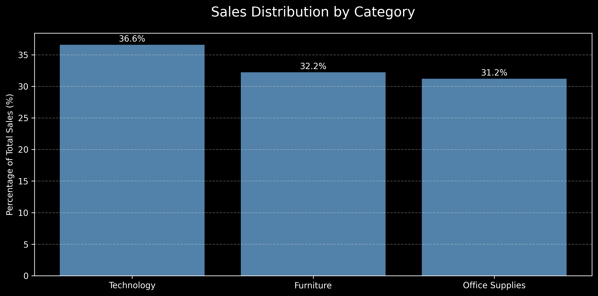
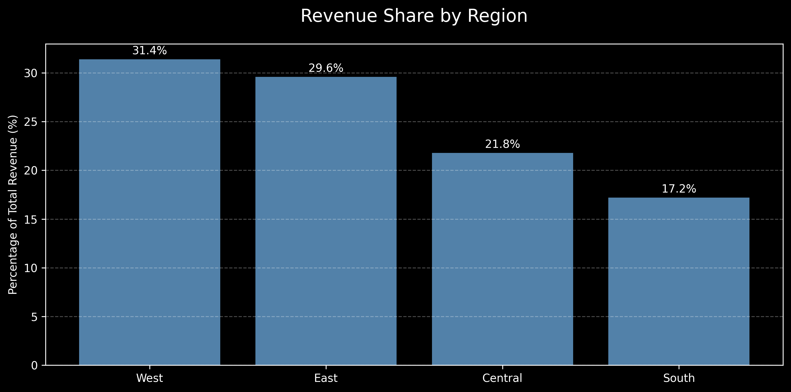
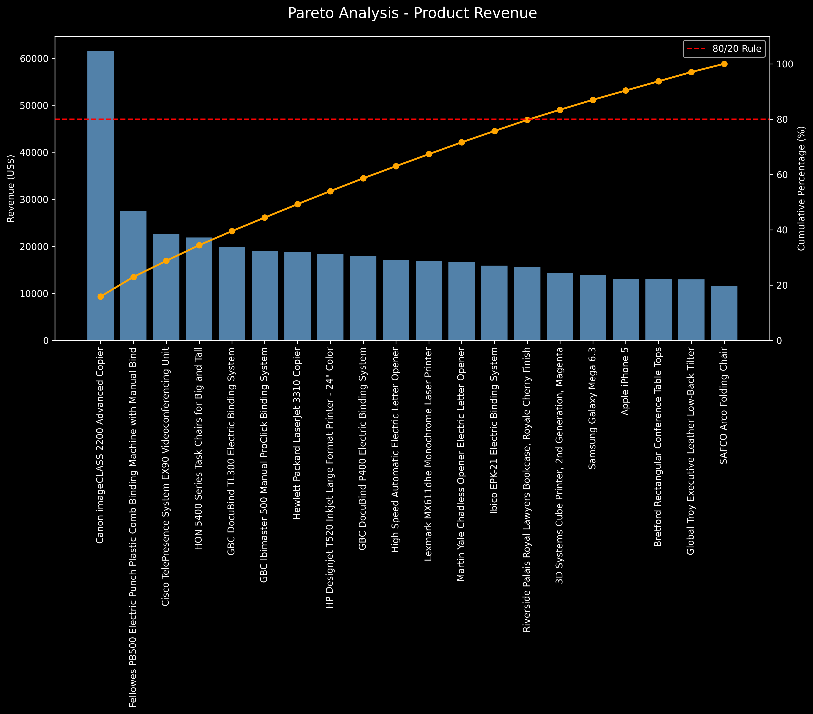

# 📊 Sales Analysis and Data Visualization

## Overview

This project analyzes a retail sales dataset using Python and Pandas to identify business insights related to revenue, customer behavior, regional performance, and product sales.

---

## Technologies Used

- Python
- Pandas
- Matplotlib
- Jupyter Notebook

---

## Key Insights

- Technology is the highest revenue-generating category.
- The West region contributes the largest share of total revenue.
- A small group of products accounts for a significant portion of overall sales.
- Pareto Analysis demonstrates the concentration of revenue among top-performing products.

---

## Revenue Share by Category

---

## Regional Revenue Distribution

---

## Pareto Analysis

---

## Files

- `sales_analysis.ipynb` → Main notebook
- `train.csv` → Dataset
- `requirements.txt` → Project dependencies

---

## Author

Caio Torres

Business Analyst Jr | Data Analytics Enthusiast
